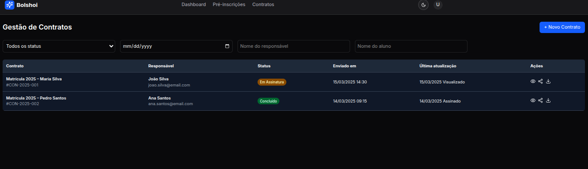
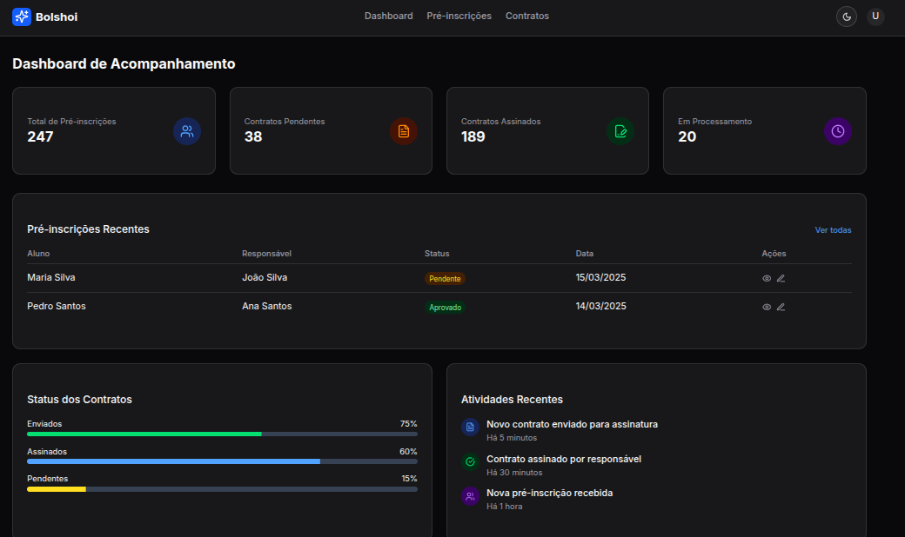
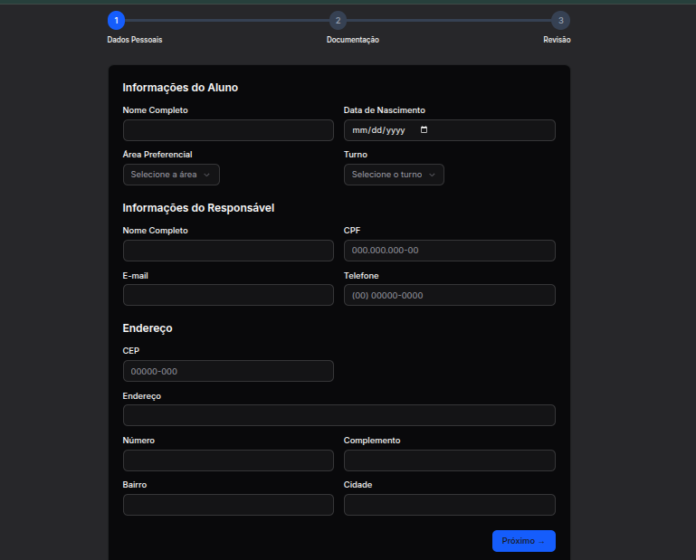

# 📄 Sistema de Gestão de Matrículas – Bolshoi

Este sistema foi desenvolvido para facilitar e organizar o processo de matrícula da Escola do Teatro Bolshoi no Brasil. Ele oferece uma interface moderna, simples e intuitiva para acompanhamento de contratos, dashboards de status e pré-cadastros.

## 🔍 Visão Geral

### 🧾 Tela de Contratos

Visualize contratos em andamento e concluídos de forma clara e organizada.

### 📊 Dashboard

Painel com métricas e status gerais das matrículas e contratos assinados.

### 📝 Pré-Cadastro

Área dedicada ao pré-cadastro de alunos e responsáveis para agilizar o processo de matrícula.

## 🚀 Tecnologias Utilizadas

- **Next.js** 15
- **TypeScript**
- **Tailwind CSS**
- **Lucide Icons**
- **Dark mode**
- **Componentização com React**

## 🤝 Contribuição

Contribuições são bem-vindas! Fique à vontade para abrir issues, pull requests ou sugerir melhorias.

---

